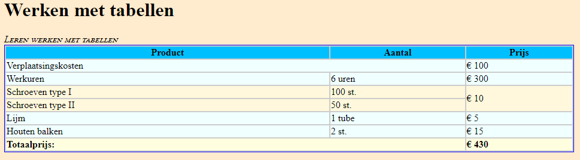
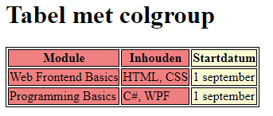

# oe-tabellen-colgroup

Maak twee pagina's met elk een eigen tabel.

De eerste tabel toont een factuur (invoice).
Bouw deze zo goed mogelijk na, met passende elementen. Gebruik echter géén `colgroup`:

De tweede tabel toont een overzicht van modules. Gebruik hier verplicht `colgroup` om de tabel te stijlen:
